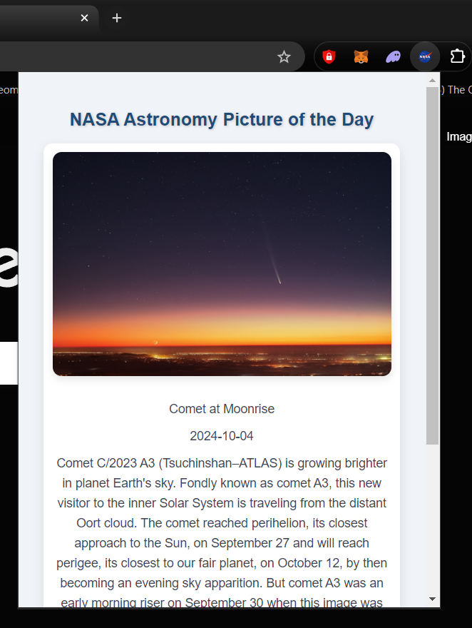

# NASA Astronomy Picture of the Day Chrome Extension

## Overview
The **NASA APOD Chrome Extension** displays NASA's "Astronomy Picture of the Day" (APOD) directly in your browser.

## Screenshot

*The NASA APOD Chrome Extension displaying today's astronomy picture.*

## Configuration
* **API Key**: The NASA APOD API requires an API key for usage. You can obtain your own key from [NASA's API Portal](https://api.nasa.gov/). Once obtained, add it to the `config.js` file as shown in the **Installation** section.

## Installation
To install and use the extension locally:

1. **Clone the repository**:
   ```bash
   git clone https://github.com/<yourusername>/nasa-apod-extension.git
   ```

2. **Install the extension**:
   * Open Chrome and navigate to `chrome://extensions/`
   * Enable **Developer Mode** using the toggle in the top-right corner
   * Click the **Load unpacked** button and select the project folder

3. **Add your NASA API key**:
   * In the project folder, create a `config.js` file by copying `config.example.js`
   * Add your own NASA API key in `config.js`:
     ```javascript
     const NASA_API_KEY = 'YOUR_API_KEY';
     ```

4. The extension is now installed and ready to use!

## License
This project is licensed under the MIT License. See the [LICENSE](LICENSE) file for more details.
